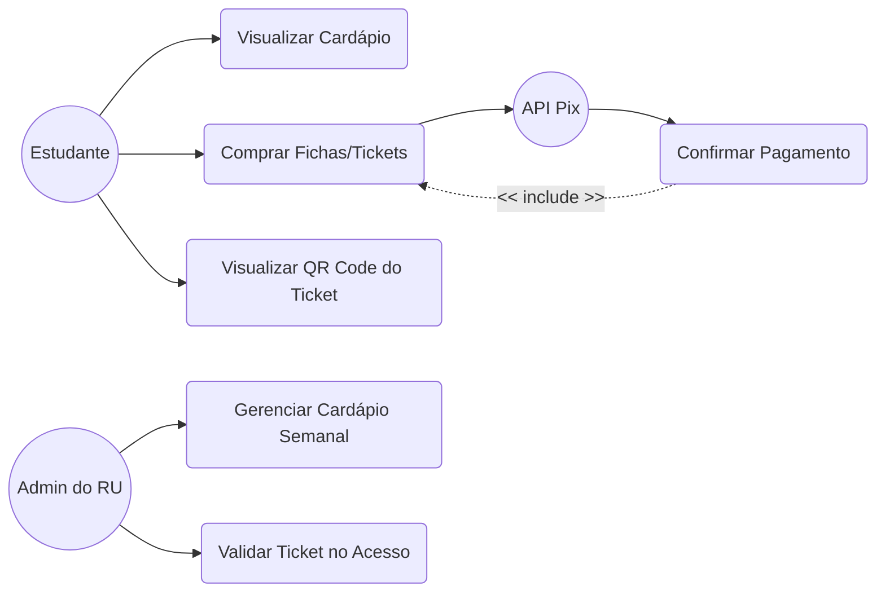
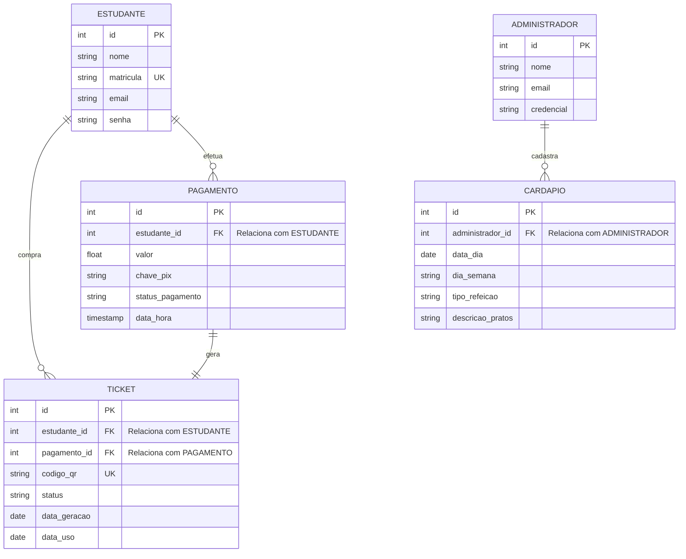
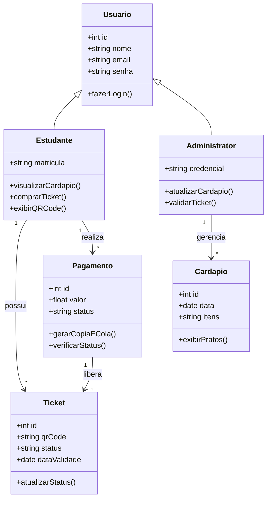
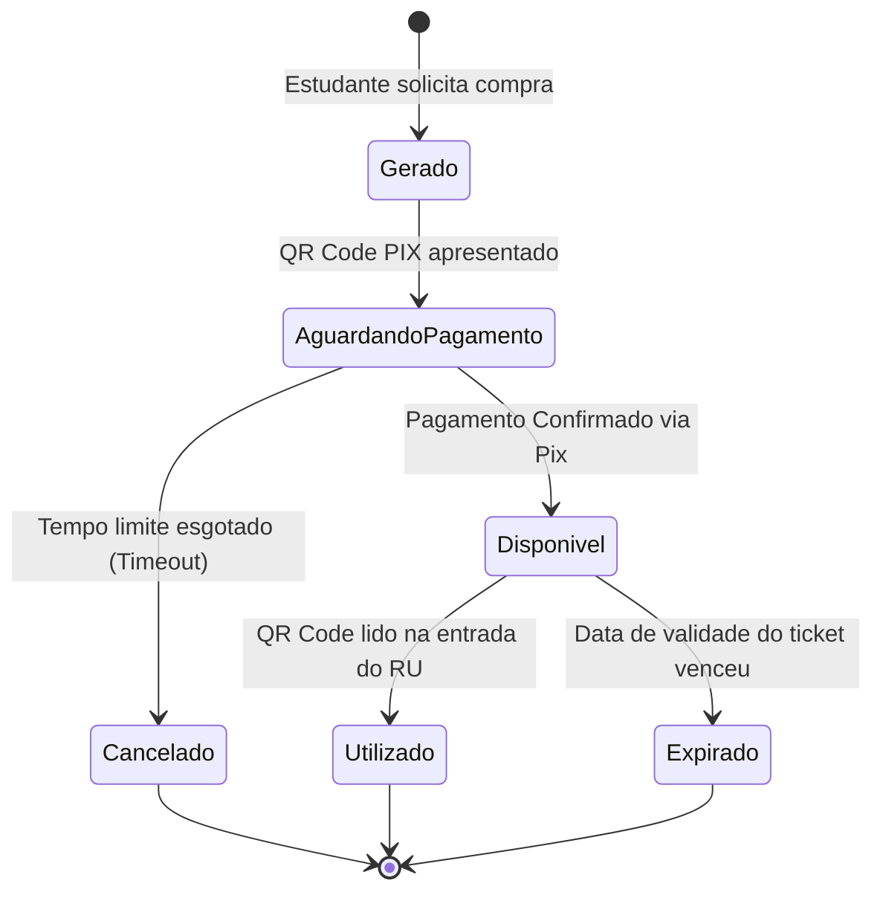

# 🍽️ Documentação do Sistema - RU UESPI

Este documento centraliza a modelagem de dados e processos do aplicativo móvel para o **Restaurante Universitário da Universidade Estadual do Piauí (UESPI)**. A estrutura utiliza diagramas em formato **Mermaid** (renderizados nativamente pelo GitHub/Notion) acompanhados de tabelas descritivas para facilitar o entendimento do projeto.

---

## 🎯 1. Diagrama de Casos de Uso

O diagrama abaixo ilustra as interações dos atores principais com as funcionalidades do aplicativo móvel.

### 📋 Detalhamento dos Casos de Uso

| Ator | Caso de Uso | Descrição |
| :--- | :--- | :--- |
| **Estudante** | `UC1` Visualizar Cardápio | Consulta os pratos e refeições planejadas para a semana corrente. |
| **Estudante** | `UC2` Comprar Fichas/Tickets | Inicia o fluxo de compra de créditos para refeição via PIX. |
| **Estudante** | `UC3` Visualizar QR Code | Exibe a ficha digital na tela para ser escaneada na entrada do RU. |
| **Admin do RU** | `UC4` Gerenciar Cardápio | Permite o cadastro, edição e exclusão dos menus semanais. |
| **Admin do RU** | `UC5` Validar Ticket | Realiza a leitura e validação do QR Code do estudante na catraca/entrada. |
| **API Pix** | `UC6` Confirmar Pagamento | Sistema externo que valida a transação financeira e notifica o app. |

---

## 🗄️ 2. Dicionário de Dados & DER

Abaixo está o modelo lógico do banco de dados (DER) acompanhado das tabelas que especificam cada entidade do sistema.

### 📊 Especificação das Tabelas (Dicionário de Dados)

#### Entidade: `ESTUDANTE`
| Atributo | Tipo | Restrição | Descrição |
| :--- | :--- | :--- | :--- |
| `id` | `int` | **PK** (Primary Key) | Identificador único do estudante. |
| `nome` | `string` | Not Null | Nome completo do usuário. |
| `matricula` | `string` | **UK** (Unique Key) | Matrícula institucional UESPI. |
| `email` | `string` | Not Null / UK | Email acadêmico ou pessoal para login. |
| `senha` | `string` | Not Null | Hash da senha de acesso. |

#### Entidade: `TICKET` (Ficha Digital)
| Atributo | Tipo | Restrição | Descrição |
| :--- | :--- | :--- | :--- |
| `id` | `int` | **PK** | Identificador único do ticket. |
| `codigo_qr` | `string` | **UK** | Token criptografado contido no QR Code. |
| `status` | `string` | Not Null | Estado atual (Disponível, Utilizado, Expirado). |
| `data_geracao`| `date` | Not Null | Data em que a compra foi confirmada. |
| `data_uso` | `date` | Nullable | Registro de quando o aluno consumiu a refeição. |

#### Entidade: `PAGAMENTO`
| Atributo | Tipo | Restrição | Descrição |
| :--- | :--- | :--- | :--- |
| `id` | `int` | **PK** | Identificador da transação financeira. |
| `valor` | `float` | Not Null | Valor cobrado pela ficha do RU. |
| `chave_pix` | `string` | Not Null | Código "Copia e Cola" ou ID do Pix gerado. |
| `status_pagamento`| `string` | Not Null | Status do gateway (Pendente, Pago, Cancelado). |
| `data_hora` | `timestamp`| Not Null | Data e hora exata da tentativa de compra. |

---

## 🏛️ 3. Diagrama de Classes

Visão estrutural orientada a objetos (POO) mapeando as classes de negócio do ecossistema do aplicativo.

### ⚙️ Métodos e Responsabilidades

| Classe | Operação Principal | Objetivo |
| :--- | :--- | :--- |
| **Estudante** | `comprarTicket()` | Dispara o fluxo de pagamento e vincula uma nova ficha à conta do usuário. |
| **Administrator** | `validarTicket()` | Executado no celular/dispositivo do fiscal para alterar o status do ticket para "Utilizado". |
| **Pagamento** | `gerarCopiaECola()`| Comunica-se com a API do Banco Central/Gateway para trazer o Pix dinâmico. |
| **Ticket** | `atualizarStatus()`| Altera internamente o ciclo de vida da ficha digital. |

---

## 🔄 4. Diagrama de Transição de Estados

Mapeamento do ciclo de vida crítico da entidade **Ticket**, vital para evitar fraudes ou duplicidade de acessos.

### 🚦 Mapeamento dos Estados do Ticket

| Estado Atual | Gatilho (Transição) | Estado Destino | Regra de Negócio |
| :--- | :--- | :--- | :--- |
| `[*] Inicial` | Solicitação do aluno | **Gerado** | O ticket entra na fila temporária do sistema. |
| `Gerado` | QR Code Pix emitido | **AguardandoPagamento**| Aguarda a notificação do webhook da API de pagamento. |
| `AguardandoPagamento`| Tempo esgotado (ex: 10 min) | **Cancelado** | O Pix expira para não prender requisições no banco. |
| `AguardandoPagamento`| Webhook confirma recebimento| **Disponivel** | O ticket torna-se válido e gera o QR Code definitivo de acesso. |
| `Disponivel` | Leitura ótica na entrada | **Utilizado** | O aluno consome a refeição. O ticket é invalidado imediatamente. |
| `Disponivel` | Validade expirada (fim do dia)| **Expirado** | Fichas diárias que não foram usadas perdem a validade (conforme regras do RU). |
